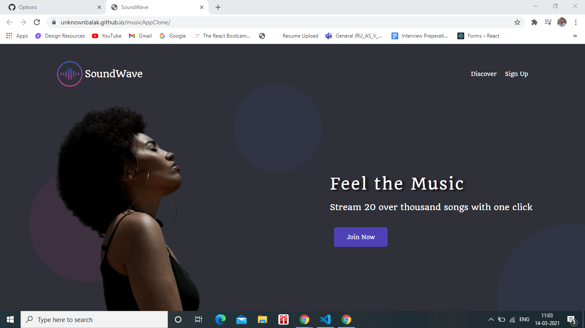
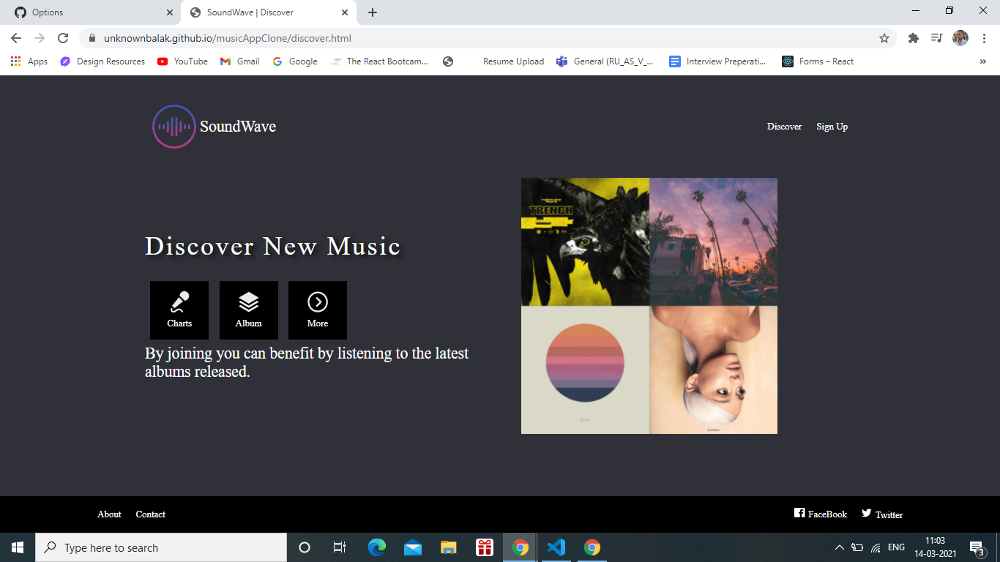
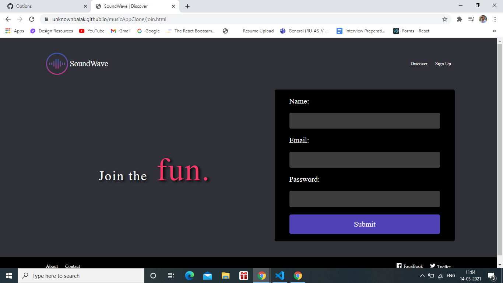

# mucicApp Clone written in HTML and CSS

I tried to build a clone of imaginary Music Company. It is written in only CSS and HTML. I would like to thanks @Web Dev Simplified for resources and @Dev Ed for design. It was quite fun to build this application without using
any frame and library.
See the landing page of the application. It is quite beautiful.

## Discovery page where you can find some features of our music Application

## Go and sign up and see the page.

.

hope you would love this.

# Preview the Page here

[gitHub Link](https://unknownbalak.github.io/musicAppClone/index.html)
